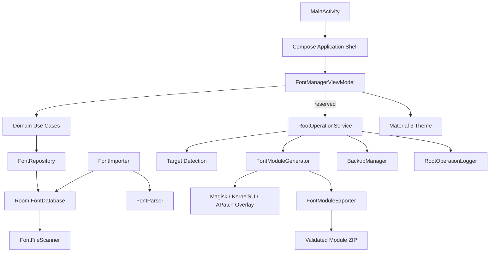

# Global Font Manager

Feature Name: global-font-manager
Updated: 2026-08-30

## Description

The fourth phase completes local module delivery. The engine backs up detected system font targets, generates a Magisk-compatible overlay module in app-private staging, installs the module through `su -c`, exports a permission-preserving ZIP, and provides manager-specific installation or sharing intents. The engine does not write to the real `/system`, `/product`, or `/system_ext` files.

The fifth phase analyzes Xiaomi system properties, font directories, and XML font priority files. The analyzer supplies dynamic targets and configuration overlays to the module generator.

## Architecture

The UI observes state through lifecycle-aware Compose collection. The ViewModel owns screen state and coordinates domain use cases. The repository owns the current in-memory font list and delegates scanning to the data source.

## Components and Interfaces

- `MainActivity`: Android entry point and Compose host.
- `FontManagerViewModel`: MVVM state holder for fonts and theme selection.
- `FontRepository`: domain-facing font data contract.
- `DefaultFontRepository`: in-memory repository implementation.
- `FontFileScanner`: data-layer scanning boundary reserved for the import phase.
- `FontImporter`: copies SAF streams into the app-private fonts directory and persists parsed entities.
- `FontParser`: reads SFNT directory, `name`, and `OS/2` tables for TTF, OTF, and TTC files.
- `FontDatabase` and `FontDao`: Room persistence for imported font metadata.
- `RootOperationService`: service-layer boundary reserved for privileged operations.
- `GlobalFontManagerTheme`: Material 3 theme with light, dark, and system selection.
- `RootShellManager`: executes bounded `su -c` commands, detects Root provider and existing target files, and installs or disables the module.
- `BackupManager`: stores each original target in app-private backup storage and verifies the latest backup during overlay recovery.
- `FontModuleGenerator`: creates the module overlay hierarchy, module metadata, lifecycle scripts, and recovery module.
- `FontReplacementEngine`: coordinates validation, free-space checks, backups, module generation, installation, verification, and rollback.
- `FontModuleExporter`: creates a ZIP with Unix modes and validates all required module entries.
- `ModuleInstaller`: creates provider-specific install intents and share/file-open fallback intents through `FileProvider`.
- `RootOperationLogger`: records every `su -c` command, exit code, timestamp, and stderr.
- `SystemFontAnalyzer`: reads real font directories, system properties, and XML font family/alias/fallback relationships.
- `FontCompatibilityChecker`: checks glyph coverage for Chinese, English, and digits using Android Typeface and Paint.
- `DeviceCompatibilityReport`: exports device, profile, target, compatibility, and error information.

## Data Models

`FontEntity` stores the requested database fields plus parsed version and language ranges. `FontFile` is the domain/UI model and maps the persisted type into `FontFormat`.

`FontBackupEntity` stores `id`, `fontName`, `originalPath`, `backupPath`, `createTime`, and `deviceInfo` for multi-version backups.

`FontModuleEntity` stores generated ZIP metadata and installation state. `RootOperationLogEntity` stores the Root audit trail.

`SystemFontProfile` stores detected versions, font paths, default language families, fallback files, parsed mappings, and source configuration files.

## Correctness Properties

- Imported files are persisted before appearing in the observable font list.
- Refreshing scans only the private fonts directory and recognizes supported extensions.
- Theme changes update the Compose color scheme through ViewModel state.
- Navigation selects exactly one destination at a time.
- The engine writes replacement files only into a Root module overlay path.
- A failed installation disables the module before attempting backup restoration.
- Exported ZIP files contain the module root directory and required lifecycle scripts.
- Emergency restore disables and removes the overlay module, allowing the original system files to reappear without writing to system partitions.

## Error Handling

Invalid extension, unreadable stream, malformed SFNT files, unavailable Root, insufficient space, and failed shell commands produce user-visible operation errors. Installation failure triggers module disable and backup restoration.

## Test Strategy

The next implementation phase should add unit tests for repository refresh and ViewModel theme state, Compose tests for navigation and theme controls, and device tests for Android 10 through Android 16 compatibility.
